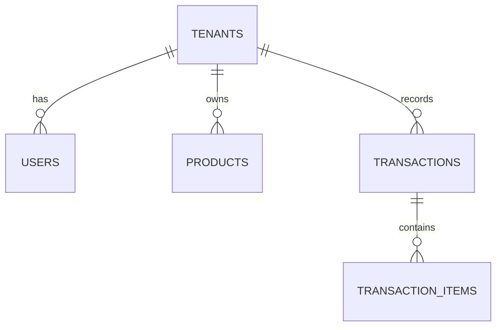

# ZII POS v1.0 — Product & Technical Requirement Document (PRD & TRD)

**Brand Name:** ZII  
**Product Name:** ZII POS  
**Product Type:** General Retail & Service White-Label POS (Multi-Tenant SaaS)  
**Founders & Core Team:** Zaqi (PM Engineer & BE Lead), Isyadi (FE Lead), Ilham (Fullstack & Integration Lead)  
**Target Release v1.0:** MVP 2–3 Minggu  

---

## 1. Product Overview & Core Values

ZII POS adalah sistem kasir berbasis Web/PWA *multi-tenant* yang dirancang untuk toko retail umum dan usaha jasa lokal (toko kelontong, distro, aksesoris HP, petshop, kedai minuman, laundry/bengkel).

### 💡 Key Differentiators (Keunggulan Utama ZII POS):
1. **100% White-Label Struk:** Struk cetak thermal & WhatsApp menampilkan **Logo + Nama Toko Merchant** sendiri tanpa embel-embel logo platform lain.
2. **Kirim Struk via WhatsApp (Green Receipt):** Struk transaksi bisa terkirim otomatis ke WhatsApp pembeli secara instan.
3. **Lightweight & Cross-Platform (PWA):** Dapat dijalankan di HP Android, iOS, Tablet, iPad, maupun Laptop tanpa perlu membeli perangkat kasir mahal.

---

## 2. Target User & Roles

1. **Merchant Owner (Pemilik Toko):**
   - Mendaftar toko & mengatur profil White-Label (Logo, Nama Toko, Alamat, Pesan Footer Struk).
   - Mengelola katalog barang/jasa & harga.
   - Melihat rekap total omset harian & riwayat transaksi.
2. **Cashier (Kasir Toko):**
   - Melakukan transaksi penjualan sehari-hari.
   - Memilih metode pembayaran (Tunai / QRIS / Transfer).
   - Mencetak struk fisik / Mengirim struk via WhatsApp.

---

## 3. Product Scope (v1.0 MVP vs Future v2.0)

| Fitur | Status v1.0 (MVP) | Status v2.0 (Future) |
| :--- | :---: | :---: |
| Auth & Multi-Tenant Login | **Wajib** | Enhanced |
| White-Label Branding (Logo, Header/Footer Struk) | **Wajib** | Custom Subdomain Domain |
| Katalog Produk & Harga (Barang & Jasa) | **Wajib** | Multi-kategori & Barcode Scanner |
| Layar Kasir & Keranjang Belanja | **Wajib** | Hold Cart / Pending Order |
| Struk Thermal Bluetooth/USB & Struk WA | **Wajib** | E-mail Receipt |
| Rekap Total Omset Harian | **Wajib** | Laporan Laba-Rugi & Export Excel |
| Stok Manajemen Dasar (Potong stok otomatis) | **Wajib** | Low Stock Warning & Opname |
| Multi-Cabang / Multi-Outlet | *Nanti* | V2.0 |

---

## 4. Technical Architecture (TRD)

### A. Recommended Tech Stack
* **Runtime & Package Manager:** Bun (Bun Workspaces Monorepo)
* **Frontend:** Next.js 16 (React 19) + Tailwind CSS + Custom Radix UI Primitives
* **Backend:** Express TS running natively di Bun
* **Database:** PostgreSQL via Prisma ORM v6 (Multi-Tenant Shared DB dengan `tenant_id`)
* **Linter & Formatter:** Biome
* **Integrasi External:**
  * Web Bluetooth / Serial API (Cetak Struk Thermal dari Browser)
  * WhatsApp API / Fonnte / Wablas (Kirim Struk WA)

---

### B. Database ERD & Schema Specs (5 Core Tables)



#### 1. Table `tenants`
```sql
CREATE TABLE tenants (
    id UUID PRIMARY KEY DEFAULT gen_random_uuid(),
    name VARCHAR(255) NOT NULL,
    logo_url TEXT,
    phone VARCHAR(50),
    address TEXT,
    receipt_footer TEXT DEFAULT 'Terima kasih telah berbelanja!',
    created_at TIMESTAMP WITH TIME ZONE DEFAULT NOW()
);
```

#### 2. Table `users`
```sql
CREATE TABLE users (
    id UUID PRIMARY KEY DEFAULT gen_random_uuid(),
    tenant_id UUID REFERENCES tenants(id) ON DELETE CASCADE,
    name VARCHAR(255) NOT NULL,
    email VARCHAR(255) UNIQUE NOT NULL,
    password_hash TEXT NOT NULL,
    role VARCHAR(20) CHECK (role IN ('owner', 'cashier')) DEFAULT 'cashier',
    created_at TIMESTAMP WITH TIME ZONE DEFAULT NOW()
);
```

#### 3. Table `products`
```sql
CREATE TABLE products (
    id UUID PRIMARY KEY DEFAULT gen_random_uuid(),
    tenant_id UUID REFERENCES tenants(id) ON DELETE CASCADE,
    name VARCHAR(255) NOT NULL,
    price DECIMAL(12, 2) NOT NULL,
    stock INT DEFAULT 0, -- 999 jika tipe Jasa
    is_service BOOLEAN DEFAULT FALSE,
    created_at TIMESTAMP WITH TIME ZONE DEFAULT NOW()
);
```

#### 4. Table `transactions`
```sql
CREATE TABLE transactions (
    id UUID PRIMARY KEY DEFAULT gen_random_uuid(),
    tenant_id UUID REFERENCES tenants(id) ON DELETE CASCADE,
    user_id UUID REFERENCES users(id),
    customer_name VARCHAR(255) DEFAULT 'Umum',
    customer_phone VARCHAR(50),
    total_amount DECIMAL(12, 2) NOT NULL,
    payment_method VARCHAR(20) CHECK (payment_method IN ('cash', 'qris', 'transfer')) DEFAULT 'cash',
    status VARCHAR(20) CHECK (status IN ('completed', 'cancelled')) DEFAULT 'completed',
    created_at TIMESTAMP WITH TIME ZONE DEFAULT NOW()
);
```

#### 5. Table `transaction_items`
```sql
CREATE TABLE transaction_items (
    id UUID PRIMARY KEY DEFAULT gen_random_uuid(),
    transaction_id UUID REFERENCES transactions(id) ON DELETE CASCADE,
    product_id UUID REFERENCES products(id),
    product_name VARCHAR(255) NOT NULL, -- Snapshot nama
    price DECIMAL(12, 2) NOT NULL,       -- Snapshot harga
    qty INT NOT NULL,
    subtotal DECIMAL(12, 2) NOT NULL
);
```

---

### C. Primary API Endpoint Contracts

1. **Auth & Tenant:**
   - `POST /api/v1/auth/register-tenant` (Register Owner & Toko baru)
   - `POST /api/v1/auth/login` (Login Kasir / Owner)
2. **Products:**
   - `GET /api/v1/products` (Ambil katalog toko)
   - `POST /api/v1/products` (Tambah produk baru)
   - `PUT /api/v1/products/:id` (Edit produk/harga)
3. **POS & Checkout:**
   - `POST /api/v1/transactions` (Simpan transaksi baru + potong stok)
   - `GET /api/v1/transactions` (Riwayat transaksi toko)
   - `POST /api/v1/transactions/:id/send-whatsapp` (Kirim struk ke WA kustomer)

---

## 5. Execution Plan & Task Breakdown (Sprint 1: 1 Minggu)

### 👨‍💻 Zaqi (PM Engineer, Backend & Integration Lead)
- [x] Setup Monorepo Bun Workspaces & Directory Structure.
- [x] Setup Database Schema Prisma ORM 5 Tabel & Seeder Script.
- [x] Implementasi Scalar API Reference Documentation (`/docs`) & Pino Logger.
- [x] Implementasi CRUD API Products & Transactions DB Persistence (dengan Pagination & Search Filter).
- [x] Implementasi Bun Unit Testing Suite (11 PASS).
- [ ] Helper & Driver Cetak Struk Thermal 58mm/80mm (`useThermalPrinter.ts`).
- [ ] Auto-Send WhatsApp Receipt Integration (`whatsappService.ts`) & Connect Action Buttons di `ReceiptModal.tsx`.

### 🎨 Isyadi (Frontend Lead — Core POS & Products UI)
- [x] Setup Project Next.js 16 + Custom Radix UI Primitives + Tailwind CSS.
- [x] Layout Utama POS (Grid Katalog Produk + Sidebar Keranjang Belanja).
- [x] Modal Pembayaran (Pilih Tunai / QRIS + Hitung Kembalian).
- [ ] Integrasi SWR / React Query untuk fetch data Produk & Transaksi dari Express API.
- [ ] Search Bar & Filter Pencarian Produk Real-Time di Layar Kasir.
- [ ] Modal Form Tambah & Edit Produk Baru di `/products`.

### ⚡ Ilham (Fullstack Lead — Auth API & Auth UI)
- [x] Endpoint Backend Auth (`POST /api/v1/auth/register-tenant` & `POST /api/v1/auth/login`).
- [ ] Halaman Login & Register Merchant UI (`/login` & `/register`).
- [ ] Client Auth Context & LocalStorage / Cookie Token Handler di Next.js.
- [ ] Protected Route Middleware untuk Halaman Kasir & Dashboard Owner.

---

## 6. Definition of Done (DoD) v1.0

ZII POS v1.0 dianggap **SELESAI & SIAP DIJUAL** jika:
1. Kasir bisa login -> pilih 3 produk -> klik bayar tunai -> stok berkurang.
2. Struk keluar di printer thermal / terkirim via WA dengan **Logo & Nama Toko Merchant**.
3. Total omset harian di dashboard ter-update akurat.
