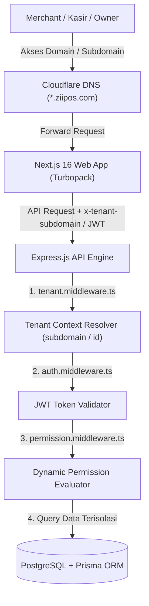
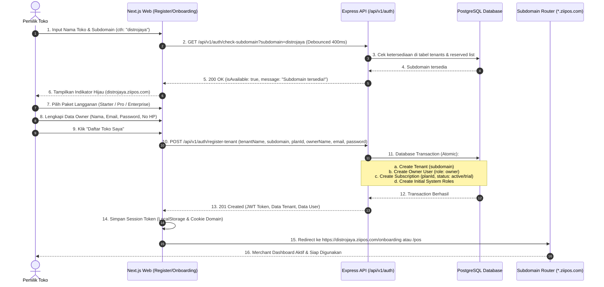
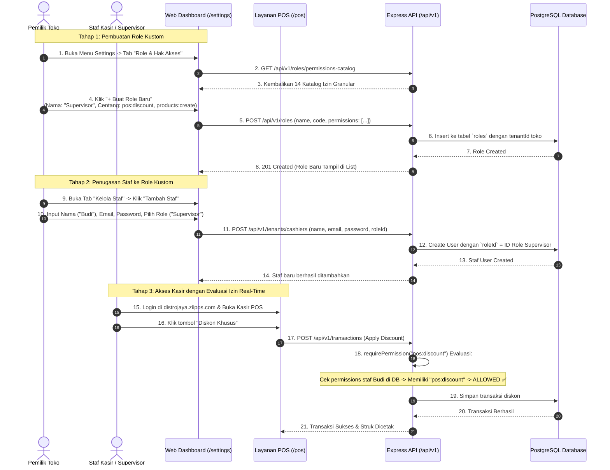

# 🗺️ ZII POS Developer Specification: User Flows & Architecture

Dokumen ini adalah **panduan resmi arsitektur dan alur kerja pengguna (*User Flow*)** untuk pengembang (*developers*) dalam mengimplementasikan dan mengembangkan fitur:
1. **User Flow 1:** Pendaftaran & Setup Merchant Pertama Kali (*Subdomain Onboarding & Plan Selection*).
2. **User Flow 2:** Enterprise Dynamic RBAC & Manajemen Staf Toko (*Custom Roles & Granular Permissions*).

---

## 🏗️ 1. Arsitektur Multi-Tenant & RBAC Overview

ZII POS v2.0 menggunakan arsitektur **Multi-Tenant Subdomain Partitioning** yang dipadukan dengan **Dynamic RBAC (Role-Based Access Control)**.



---

## 🚀 2. User Flow 1: Pendaftaran & Setup Merchant Pertama Kali

Alur ini mengatur bagaimana pemilik toko (*Merchant Owner*) mendaftar, memilih subdomain unik toko, memilih paket langganan SaaS, hingga masuk ke dashboard tokonya.

### 2.1 Sequence Diagram Alur Pendaftaran



### 2.2 Tahapan State Machine Form Pendaftaran

| Step | Layar / Form | Input yang Dibutuhkan | Aksi & Validasi Frontend | API Endpoint Terkait |
| :--- | :--- | :--- | :--- | :--- |
| **Step 1** | **Profil Toko & Subdomain** | - Nama Toko<br/>- Pilihan Subdomain | - Sanitasi karakter (hanya huruf, angka, tanda strip `-`).<br/>- Real-time debounced checking.<br/>- Minimal 3 karakter, maks 32 karakter. | `GET /api/v1/auth/check-subdomain?subdomain={val}` |
| **Step 2** | **Pilih Paket SaaS** | - Pilihan Plan (`starter`, `pro`, `enterprise`) | - Menampilkan kartu harga, limit kasir, & fitur.<br/>- Default memilih paket aktif. | `GET /api/v1/plans` |
| **Step 3** | **Akun Owner** | - Nama Lengkap Owner<br/>- Email Owner<br/>- Password (min 6 char)<br/>- No HP WhatsApp | - Validasi format email & kecocokan password.<br/>- Formatting nomor telepon internasional (`+62`). | - |
| **Step 4** | **Konfirmasi & Submit** | - Ringkasan Pendaftaran | - Loading spinner state.<br/>- Menyimpan JWT & mengarahkan ke dashboard. | `POST /api/v1/auth/register-tenant` |

### 2.3 Kontrak API Pendaftaran & Subdomain

#### A. Cek Ketersediaan Subdomain
- **Endpoint:** `GET /api/v1/auth/check-subdomain?subdomain=distrojaya`
- **Response Success (200 OK):**
```json
{
  "success": true,
  "message": "Subdomain 'distrojaya' tersedia!",
  "data": {
    "isAvailable": true,
    "subdomain": "distrojaya",
    "message": "Subdomain 'distrojaya' tersedia!"
  }
}
```
- **Response Error / Collision (400 Bad Request):**
```json
{
  "success": false,
  "message": "Subdomain 'distrojaya' sudah digunakan oleh toko lain.",
  "error": {
    "name": "Error",
    "details": "Subdomain 'distrojaya' sudah digunakan oleh toko lain."
  }
}
```

#### B. Registrasi Tenant Baru
- **Endpoint:** `POST /api/v1/auth/register-tenant`
- **Request Body:**
```json
{
  "tenantName": "ZII Distro & Apparel Studio",
  "subdomain": "distrojaya",
  "planId": "plan-uuid-pro",
  "ownerName": "Ahmad Zaqi",
  "email": "zaqi@distrojaya.com",
  "password": "password123",
  "phone": "081299887766",
  "address": "Jl. Merdeka No. 45, Jakarta"
}
```
- **Response Success (201 Created):**
```json
{
  "success": true,
  "message": "Pendaftaran Merchant ZII POS berhasil!",
  "data": {
    "token": "eyJhbGciOiJIUzI1NiIsInR5cCI6IkpXVCJ9...",
    "tenant": {
      "id": "tenant-uuid-123",
      "name": "ZII Distro & Apparel Studio",
      "subdomain": "distrojaya",
      "phone": "081299887766",
      "address": "Jl. Merdeka No. 45, Jakarta"
    },
    "user": {
      "id": "user-uuid-456",
      "name": "Ahmad Zaqi",
      "email": "zaqi@distrojaya.com",
      "role": "owner"
    }
  }
}
```

---

## 🛡️ 3. User Flow 2: Enterprise Dynamic RBAC & Manajemen Staf

Alur ini mengatur bagaimana pemilik toko membuat **Role Kustom** dengan hak akses granular, menugaskannya ke staf kasir, dan bagaimana sistem mengevaluasi hak akses secara real-time.

### 3.1 Sequence Diagram Alur Dynamic RBAC



### 3.2 Matriks 14 Izin Granular (*Permission Catalog*)

| Kategori | Kode Izin (`permission`) | Nama Izin | Deskripsi / Fungsi |
| :--- | :--- | :--- | :--- |
| **Kasir & POS** | `pos:access` | Akses Terminal Kasir | Membuka layar kasir POS dan memproses transaksi penjualan standar. |
| | `pos:discount` | Berikan Diskon Manual | Menginput potongan harga atau diskon khusus pada transaksi. |
| | `pos:void_tx` | Void / Batalkan Transaksi | Membatalkan transaksi yang sedang berjalan atau mereset keranjang. |
| **Produk & Stok** | `products:read` | Lihat Katalog Produk | Melihat daftar produk, harga, dan ketersediaan stok. |
| | `products:create` | Tambah Produk Baru | Menambahkan item barang atau jasa baru ke katalog toko. |
| | `products:update` | Edit Produk & Harga | Mengubah nama, barcode, harga jual, harga modal, atau stok. |
| | `products:delete` | Hapus Produk | Menghapus item produk dari inventaris toko secara permanen. |
| **Laporan & Keuangan** | `transactions:read` | Lihat Riwayat Transaksi | Melihat rekap dan rincian transaksi penjualan toko. |
| | `transactions:export` | Ekspor Laporan Penjualan | Mengunduh rekapan transaksi ke dalam file Excel / CSV. |
| **Manajemen Toko** | `cashiers:manage` | Kelola Staf & Kasir | Menambah, mengedit, atau menghapus akun staf toko. |
| | `roles:manage` | Kelola Role & Hak Akses | Membuat dan mengatur permission matriks role dinamis toko. |
| | `settings:manage` | Pengaturan Profil & Struk | Mengatur logo struk, nama toko, footer nota, dan alamat. |
| | `billing:manage` | Kelola Langganan SaaS | Melakukan upgrade paket, checkout perpanjangan, & unduh invoice. |
| **Super Admin** | `saas:admin` | SaaS Platform Admin | Manajemen multi-tenant global & paket platform ZII POS (`*` wildcard). |

### 3.3 Kontrak API Manajemen Role (`/api/v1/roles`)

#### A. Ambil Katalog Izin Sistem
- **`GET /api/v1/roles/permissions-catalog`** (Public / Authenticated)
- **Response:**
```json
{
  "success": true,
  "message": "Katalog permission berhasil diambil",
  "data": [
    {
      "code": "pos:access",
      "name": "Akses Kasir POS",
      "category": "POS & Kasir",
      "description": "Dapat membuka terminal kasir dan checkout penjualan"
    },
    {
      "code": "pos:discount",
      "name": "Beri Diskon Penjualan",
      "category": "POS & Kasir",
      "description": "Dapat memberikan diskon khusus manual pada transaksi"
    }
  ]
}
```

#### B. Buat Role Kustom Baru
- **`POST /api/v1/roles`** (Guard: `requirePermission("roles:manage")`)
- **Request Body:**
```json
{
  "name": "Supervisor Shift Pagi",
  "code": "supervisor_pagi",
  "description": "Bisa kasih diskon dan edit harga produk",
  "permissions": [
    "pos:access",
    "pos:discount",
    "products:read",
    "products:update",
    "transactions:read"
  ]
}
```

#### C. Hapus Role Kustom (Dengan Safety Check)
- **`DELETE /api/v1/roles/:id`** (Guard: `requirePermission("roles:manage")`)
- **Response Jika Masih Ada User Aktif (400 Bad Request):**
```json
{
  "success": false,
  "message": "Role 'Supervisor Shift Pagi' tidak dapat dihapus karena masih digunakan oleh 2 staf. Pindahkan staf ke role lain terlebih dahulu.",
  "error": {
    "name": "Error",
    "details": "Role 'Supervisor Shift Pagi' tidak dapat dihapus karena masih digunakan oleh 2 staf."
  }
}
```

---

## 💻 4. Panduan Implementasi untuk Developer

### 4.1 Frontend Developers (Next.js)

#### 1. Hook Pemeriksaan Izin Pengguna (`useHasPermission`)
Buat helper hook di `@/features/auth/hooks/useHasPermission.ts`:
```tsx
import { useAuth } from "@/features/auth/context/AuthContext";

export function useHasPermission(...requiredPermissions: string[]): boolean {
  const { user, permissions } = useAuth();

  if (user?.role === "superadmin") return true;
  if (!permissions || permissions.length === 0) return false;

  return requiredPermissions.some(
    (perm) => permissions.includes(perm) || permissions.includes("*"),
  );
}
```

#### 2. Komponen Guarding UI (`<PermissionGate>`)
Gunakan untuk menyembunyikan tombol/menu yang tidak boleh diakses staf:
```tsx
import { useHasPermission } from "@/features/auth/hooks/useHasPermission";

interface PermissionGateProps {
  permission: string | string[];
  children: React.ReactNode;
  fallback?: React.ReactNode;
}

export function PermissionGate({ permission, children, fallback = null }: PermissionGateProps) {
  const perms = Array.isArray(permission) ? permission : [permission];
  const hasAccess = useHasPermission(...perms);

  if (!hasAccess) return <>{fallback}</>;
  return <>{children}</>;
}
```
*Contoh Penggunaan:*
```tsx
<PermissionGate permission="pos:discount">
  <button onClick={openDiscountModal} className="btn-discount">
    Beri Diskon
  </button>
</PermissionGate>
```

---

### 4.2 Backend Developers (Express API)

#### 1. Memasang Guard di Rute API Baru
Setiap kali membuat modul atau endpoint baru di backend, gunakan `requirePermission`:
```ts
import { Router } from "express";
import { authMiddleware } from "../../middlewares/auth.middleware";
import { requirePermission } from "../../middlewares/permission.middleware";
import { tenantMiddleware } from "../../middlewares/tenant.middleware";

const router = Router();
router.use(tenantMiddleware, authMiddleware);

// Contoh: Rute yang membutuhkan izin ekspor laporan
router.get(
  "/export-excel",
  requirePermission("transactions:export"),
  ReportController.exportExcel,
);
```

---

## 🧪 5. Checklist Verifikasi & Testing Pengembang

Sebelum membuat Pull Request atau merilis perubahan:
- [ ] Jalankan unit test RBAC: `bun test apps/api/src/modules/role/`
- [ ] Jalankan isolasi cross-tenant test: `bun test apps/api/src/modules/role/__tests__/cross-tenant-rbac.test.ts`
- [ ] Jalankan seluruh suite test monorepo: `bun test`
- [ ] Pastikan Next.js build sukses: `bun --filter '@zii/web' build`
- [ ] Cek Scalar API Docs di browser: `http://localhost:3001/docs`

---
*Dokumen ini dipelihara oleh tim ZII POS Core Engine. Versi: 2.0.0-enterprise.*
