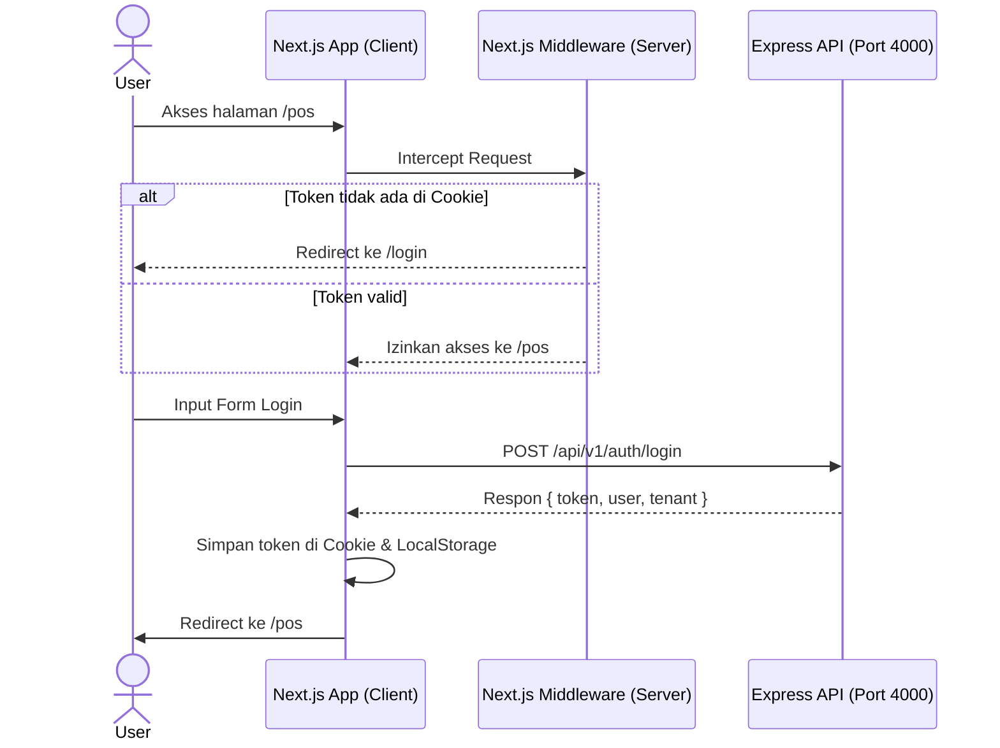

# Rencana Implementasi: Fitur Otentikasi (feature/auth-fullstack) 🔐

Rencana kerja detail untuk mengimplementasikan otentikasi penuh di ZII POS. Tugas ini mencakup UI Login & Register, Client Auth Context (State & Session Management), serta Protected Routes Middleware pada Next.js 16.

---

## 📋 1. Ringkasan Fitur & Arsitektur
Tujuan dari fitur ini adalah mengamankan rute-rute dashboard kasir (`/pos`, `/products`, `/settings`) dan mengelola siklus hidup sesi pengguna (kasir & owner) menggunakan token JWT yang diterima dari Express API (`http://localhost:4000/api/v1/auth`).

> [!IMPORTANT]
> **Fokus Pengerjaan**: Sisi Backend API (`POST /api/v1/auth/register-tenant` & `/login`) telah selesai diimplementasikan 100% oleh Zaqi. Tugas Anda (Ilham) sepenuhnya terfokus pada **integrasi sisi Frontend (FE) Next.js** untuk menghubungkan halaman login/register, mengonsumsi data API via TanStack Query, mengelola cookie/token session, dan memproteksi rute halaman POS.



---

## 🛠️ 2. Standar & Aturan Pengerjaan
1. **State Management & Fetching**: Menggunakan **TanStack Query (React Query)** untuk fetching API.
2. **UI & Styling**: Menggunakan **Custom Radix UI Headless Primitives + Tailwind CSS**. Dilarang menggunakan shadcn/ui.
3. **Validasi Form**: Menggunakan **Zod** untuk validasi skema form input client-side.
4. **Keamanan Sesi**: Menyimpan JWT token di **Cookie** (agar terbaca oleh Middleware server-side) dan data profil dasar di **LocalStorage** (untuk kemudahan akses Client Context).
5. **Quality Control**: Sebelum melakukan commit/push ke branch `feature/auth-fullstack`, pastikan menjalankan:
   ```bash
   bun run lint:fix # Biome JS Linter & Formatter
   bun test         # Bun Unit Tests
   ```

---

## 📂 3. Struktur Berkas yang Akan Dibuat/Diubah

### [NEW] Berkas Otentikasi
*   **`apps/web/src/features/auth/`** (Folder Modul Fitur Auth)
    *   `components/LoginForm.tsx` — Form UI login kustom.
    *   `components/RegisterForm.tsx` — Form UI registrasi merchant & owner baru.
    *   `context/AuthContext.tsx` — React Context Provider untuk mengelola status auth client.
    *   `hooks/useAuth.ts` — Custom hook untuk mengakses status otentikasi.
*   **`apps/web/src/app/`** (Halaman Rute Next.js)
    *   `login/page.tsx` — Halaman UI `/login`.
    *   `register/page.tsx` — Halaman UI `/register`.
*   **`apps/web/src/middleware.ts`** (Proteksi Rute Server-Side)
    *   Middleware untuk membatasi akses `/pos`, `/products`, dan `/settings`.

### [MODIFY] Berkas yang Ada
*   **`apps/web/src/lib/api-client.ts`** — Mengintegrasikan token JWT dinamis dari AuthContext/Cookie ke dalam header API request.

---

## ⚙️ 4. Detail Langkah Implementasi

### Langkah A: Client Session & Token Handler (`AuthContext.tsx`)
1. Buat **`AuthContext`** yang memiliki state:
   * `user`: `{ id: string, name: string, email: string, role: string } | null`
   * `tenant`: `{ id: string, name: string, logoUrl?: string } | null`
   * `token`: `string | null`
   * `isAuthenticated`: `boolean`
   * `isLoading`: `boolean`
2. Fungsi yang diekspos:
   * `login(email, password)`: Melakukan mutasi API via TanStack Query, menyimpan hasil token ke cookie dan data user/tenant ke localstorage.
   * `register(tenantName, phone, address, ownerName, email, password)`: Registrasi toko baru, lalu otomatis login.
   * `logout()`: Menghapus token di cookie, menghapus localstorage, dan me-redirect pengguna ke `/login`.
3. Buat utilitas pembantu untuk memanipulasi cookie di client (`document.cookie`) tanpa dependensi tambahan jika memungkinkan.

### Langkah B: Integrasi API Client (`api-client.ts`)
Ubah berkas [api-client.ts](file:///e:/project-nextjs/zii-pos/apps/web/src/lib/api-client.ts) agar mengambil token dari cookie secara otomatis:
```typescript
// Konsep implementasi di apps/web/src/lib/api-client.ts
import { getCookie } from "./utils"; // buat fungsi pembantu pembaca cookie

const token = getCookie("zii_auth_token");
const tenantId = getCookie("zii_tenant_id") || "demo-tenant-01";

headers: {
  "Content-Type": "application/json",
  ...(token ? { "Authorization": `Bearer ${token}` } : {}),
  "x-tenant-id": tenantId,
  ...(options?.headers || {}),
}
```

### Langkah C: Halaman Register & Login UI
1. Gunakan `@radix-ui/react-label` untuk label input dan elemen input kustom.
2. Buat styling visual premium berlatar belakang gelap/emerald dengan transisi halus menggunakan Tailwind CSS.
3. Contoh skema Zod untuk form validasi:
   ```typescript
   const loginSchema = z.object({
     email: z.string().email("Format email tidak valid"),
     password: z.string().min(8, "Password minimal 8 karakter"),
   });
   ```

### Langkah D: Protected Route Middleware (`middleware.ts`)
Buat berkas [apps/web/src/middleware.ts](file:///e:/project-nextjs/zii-pos/apps/web/src/middleware.ts):
```typescript
import { NextResponse } from "next/server";
import type { NextRequest } from "next/server";

export function middleware(request: NextRequest) {
  const token = request.cookies.get("zii_auth_token")?.value;
  const { pathname } = request.nextUrl;

  // Rute yang butuh otentikasi
  const isProtectedRoute = pathname.startsWith("/pos") || 
                           pathname.startsWith("/products") || 
                           pathname.startsWith("/settings");

  // Rute publik otentikasi
  const isAuthRoute = pathname === "/login" || pathname === "/register";

  if (isProtectedRoute && !token) {
    return NextResponse.redirect(new URL("/login", request.url));
  }

  if (isAuthRoute && token) {
    return NextResponse.redirect(new URL("/pos", request.url));
  }

  return NextResponse.next();
}

export const config = {
  matcher: ["/pos/:path*", "/products/:path*", "/settings/:path*", "/login", "/register"],
};
```

---

## 🧪 5. Rencana Verifikasi & Pengujian
* **Verifikasi Fungsional**:
  * Melakukan registrasi tenant/owner baru -> Pastikan redirect ke `/pos` dan database mencatat user & tenant baru.
  * Logout -> Pastikan cookie & localstorage terhapus, lalu redirect ke `/login`.
  * Mencoba bypass URL `/pos` tanpa login -> Pastikan terlempar kembali ke `/login`.
* **Verifikasi Mutu & Standard**:
  * Jalankan `bun run lint:fix` untuk memastikan tidak ada error linter Biome.
  * Jalankan `bun test` untuk memastikan semua test suite berjalan lancar.
