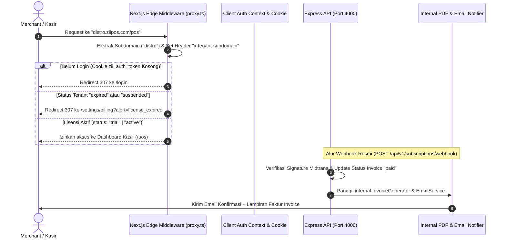

# Rencana Implementasi: Subdomain Routing, Trial Guard & Invoice (feature/subdomain-trial-guard) ⚡

Rencana kerja bertahap (*Incremental Implementation & Verification Plan*) untuk **Ilham (Fullstack Lead)** pada **Sprint v2.0.0 Commercial SaaS Platform**. 

Dokumen ini disusun agar setiap task dapat dikerjakan satu per satu secara modular, langsung diverifikasi melalui **`bun test`** dan **Pengujian Manual Terpandu**, serta 100% patuh terhadap standar koding tim ZII dan spesifikasi **OpenAPI Scalar UI (`http://localhost:4000/docs`)**.

---

## 📋 1. Ringkasan Fitur & Penyelarasan API Backend

ZII POS v2.0.0 mentransformasi sistem menjadi **Platform Multi-Tenant SaaS Komersial**. Seluruh endpoint backend yang diperlukan telah aktif dan terverifikasi di backend Express (`http://localhost:4000/docs`):

| Kebutuhan Fitur Ilham | Endpoint OpenAPI Resmi (`/docs`) | Method | Kontrak Data Model |
|:---|:---|:---:|:---|
| **Auth & Sesi Multi-Tenant** | `/api/v1/auth/login`<br>`/api/v1/auth/register-tenant` | `POST` | Input: `LoginInput`, `RegisterTenantInput`<br>Response: `{ token, tenant, user }` |
| **Status Lisensi & Trial** | `/api/v1/subscriptions/current` | `GET` | Response: `CurrentSubscription` (status: `"trial"` \| `"active"` \| `"expired"` \| `"suspended"`) |
| **Payment Settlement & Invoice** | `/api/v1/subscriptions/webhook` | `POST` | Payload: `PaymentWebhookPayload` (status: `"settlement"`) |

> [!IMPORTANT]
> **Prinsip Pengerjaan**:
> 1. **Tidak membuat endpoint REST API baru** di luar yang sudah ada di `/docs`.
> 2. Pengerjaan dilakukan secara **bertahap (Task 1 ➡️ Task 2 ➡️ Task 3 ➡️ Task 4)**.
> 3. Setiap task wajib diuji (**Automated `bun test` + Manual Testing**) sebelum melangkah ke task berikutnya.

---

## 🗺️ 2. Diagram Alur Sistem Terintegrasi



---

## 🛠️ 3. Panduan Implementasi & Pengujian Bertahap (Step-by-Step)

---

### 🌐 TAHAP 1: Subdomain Rewrite Middleware

#### A. Deskripsi & Ruang Lingkup
Membaca hostname request yang masuk di Next.js Edge Middleware (contoh: `distro.ziipos.com` atau `distro.localhost:3000`), mengekstrak nama subdomain, dan menginjeksi header `x-tenant-subdomain` ke downstream request.

#### B. Berkas yang Dibuat / Dimodifikasi
* **`apps/web/src/lib/subdomain.ts`** `[NEW]`: Utility helper parsing hostname.
* **`apps/web/src/middleware.ts`** `[MODIFY]`: Menambahkan ekstraksi subdomain dan rewrite header.

#### C. Langkah Implementasi Kode
1. Buat fungsi helper di `apps/web/src/lib/subdomain.ts`:
   - Mengabaikan domain utama (`ziipos.com`, `localhost:3000`, `app.ziipos.com`, `www.ziipos.com`).
   - Mengambil prefix subdomain jika ada (`distro.ziipos.com` ➡️ `"distro"`).
2. Perbarui `apps/web/src/middleware.ts` untuk membaca header `host` dan menyuntikkan `x-tenant-subdomain` ke `NextResponse.next({ request: { headers } })`.

#### D. Prosedur Verifikasi & Pengujian Tahap 1
1. **Automated Testing:**
   ```bash
   bun test
   ```
2. **Manual Testing Guide:**
   - Buka browser pada URL: `http://distro.localhost:3000/login`.
   - Buka DevTools (F12) ➡️ Tab **Network** ➡️ Refresh halaman ➡️ Klik request dokumen `login`.
   - Periksa bagian **Request Headers**: Pastikan header `x-tenant-subdomain: distro` terkirim.
   - Buka URL `http://localhost:3000/login` (tanpa subdomain): Pastikan header bernilai `null` (fallback ke mode utama).

---

### 🔐 TAHAP 2: Subdomain Auth Context & JWT Cookie Isolation

#### A. Deskripsi & Ruang Lingkup
Menyesuaikan penyimpanan sesi JWT di browser agar mendukung multi-subdomain scoping (`.ziipos.com` di production dan host-only di localhost) serta menyimpan status lisensi tenant (`zii_tenant_status`) ke dalam cookie saat login/register.

#### B. Berkas yang Dibuat / Dimodifikasi
* **`apps/web/src/lib/cookies.ts`** `[MODIFY]`: Tambahkan parameter opsional `domain` pada `setCookie` dan `deleteCookie`.
* **`apps/web/src/features/auth/context/AuthContext.tsx`** `[MODIFY]`: Sinkronisasi `zii_tenant_status` (`trial` | `active` | `expired` | `suspended`) dan `zii_tenant_subdomain`.

#### C. Langkah Implementasi Kode
1. Perbarui `setCookie(name, value, days, domain)` di `apps/web/src/lib/cookies.ts`.
2. Di `AuthContext.tsx`:
   - Saat fungsi `login()` atau `register()` berhasil menerima response dari backend `POST /api/v1/auth/login`, simpan cookie:
     - `zii_auth_token`: token JWT
     - `zii_tenant_id`: id tenant
     - `zii_tenant_status`: status lisensi tenant (`loggedTenant.status || "trial"`)
   - Saat `logout()`, hapus seluruh cookie sesi tersebut.

#### D. Prosedur Verifikasi & Pengujian Tahap 2
1. **Automated Testing:**
   ```bash
   bun test
   ```
2. **Manual Testing Guide:**
   - Buka `http://distro.localhost:3000/login`.
   - Login dengan kredensial: `zaqi@zii.id` / `password123`.
   - Buka DevTools (F12) ➡️ Tab **Application** ➡️ **Cookies**.
   - Pastikan terdapat 3 cookie aktif: `zii_auth_token`, `zii_tenant_id`, dan `zii_tenant_status`.
   - Klik Logout ➡️ Pastikan ketiga cookie terhapus bersih dan user kembali ke `/login`.

---

### 🛡️ TAHAP 3: Trial Period Expiry Guard Middleware

#### A. Deskripsi & Ruang Lingkup
Memproteksi rute operasional kasir (`/pos`, `/products`, `/transactions`) di level middleware. Jika toko berstatus `"expired"` atau `"suspended"`, akses kasir langsung diblokir dan di-redirect ke `/settings/billing`.

#### B. Berkas yang Dibuat / Dimodifikasi
* **`apps/web/src/middleware.ts`** `[MODIFY]`: Menambahkan pengecekan `zii_tenant_status` sebelum mengizinkan rute kasir.

#### C. Langkah Implementasi Kode
1. Di `apps/web/src/middleware.ts`:
   - Ambil nilai cookie `zii_tenant_status`.
   - Definisikan rute yang dilindungi lisensi:
     ```typescript
     const isOperationalRoute = pathname.startsWith("/pos") || 
                                pathname.startsWith("/products") || 
                                pathname.startsWith("/transactions");
     ```
   - Jika `isOperationalRoute` diakses dan `status === "expired"` atau `status === "suspended"`:
     - Redirect 307 ke `new URL("/settings/billing?alert=license_expired", request.url)`.
   - Izinkan akses ke rute `/settings/billing`, `/settings`, `/login`, `/register`, dan file statis.

#### D. Prosedur Verifikasi & Pengujian Tahap 3
1. **Automated Testing:**
   ```bash
   bun test
   ```
2. **Manual Testing Guide:**
   - **Uji Kasus Lisensi Aktif**:
     - Pastikan cookie `zii_tenant_status` bernilai `"trial"` atau `"active"`.
     - Akses `http://localhost:3000/pos` ➡️ Berhasil masuk ke layar kasir.
   - **Uji Kasus Lisensi Habis (Expired)**:
     - Di DevTools ➡️ Application ➡️ Cookies, ubah nilai `zii_tenant_status` menjadi `"expired"`.
     - Coba buka `http://localhost:3000/pos` atau `http://localhost:3000/products`.
     - **Hasil**: Browser otomatis terlempar ke `http://localhost:3000/settings/billing?alert=license_expired`.
     - Buka `http://localhost:3000/settings/billing` ➡️ Halaman billing tetap terbuka agar merchant bisa checkout langganan.

---

### 🧾 TAHAP 4: PDF Invoice Generator & Email Notifier (Backend)

#### A. Deskripsi & Ruang Lingkup
Membuat engine perender invoice PDF/HTML resmi dan service dispatcher email konfirmasi pembayaran saat webhook `POST /api/v1/subscriptions/webhook` menerima status `settlement`.

#### B. Berkas yang Dibuat / Dimodifikasi
* **`apps/api/src/modules/subscription/invoice.generator.ts`** `[NEW]`: Generator Faktur Invoice PDF & HTML profesional.
* **`apps/api/src/modules/subscription/email.service.ts`** `[NEW]`: Dispatcher email konfirmasi pembayaran.
* **`apps/api/src/modules/subscription/__tests__/invoice.test.ts`** `[NEW]`: Unit test khusus invoice & email.
* **`apps/api/src/modules/subscription/subscription.service.ts`** `[MODIFY]`: Hubungkan invoice generator saat webhook settlement.

#### C. Langkah Implementasi Kode
1. Buat `invoice.generator.ts`:
   - Format nomor invoice: `INV-{YYYYMMDD}-{KODE_PAKET}-{4_DIGIT_RANDOM}`.
   - Layout faktur White-Label ZII POS dengan header nama merchant, rincian biaya paket, tanggal bayar, dan cap `LUNAS / PAID`.
2. Buat `email.service.ts`:
   - Fungsi `sendSubscriptionInvoiceEmail(...)` yang mencatat detail pengiriman di console development dan siap dihubungkan ke SMTP/Resend di production.
3. Di `subscription.service.ts` pada method `handlePaymentWebhook`:
   - Saat status transaksi `settlement`, panggil `InvoiceGenerator` dan `EmailService`.

#### D. Prosedur Verifikasi & Pengujian Tahap 4
1. **Automated Unit Testing:**
   ```bash
   bun test apps/api/src/modules/subscription/__tests__/invoice.test.ts
   bun test
   ```
   *Target: Seluruh test suite (31+ tests) berstatus **PASS**.*
2. **Manual Testing Guide:**
   - Buka Scalar API Docs: `http://localhost:4000/docs`.
   - Buka endpoint `POST /api/v1/subscriptions/webhook`.
   - Kirim payload simulasi pembayaran sukses Midtrans:
     ```json
     {
       "order_id": "inv-demo-01",
       "transaction_status": "settlement",
       "gross_amount": "99000.00",
       "signature_key": "dummy-signature"
     }
     ```
   - **Hasil**: Response API `200 OK`, dan di terminal backend muncul log:
     - `📄 [InvoiceGenerator] Generated Invoice INV-20260816-PRO-XXXX`
     - `📧 [EmailService] Confirmation email sent to merchant owner.`

---

## 🚀 4. Checklist Pre-Push Final Tim ZII

Setelah Tahap 1 s/d Tahap 4 selesai dan terverifikasi:

```bash
# 1. Jalankan Linter & Auto-Fix Biome
bun run lint:fix

# 2. Jalankan Seluruh Unit Test Backend
bun test

# 3. Verifikasi Build Frontend Next.js 16
cd apps/web && bun run build && cd ../..
```

*Jika seluruh checklist lolos (0 Error / 100% PASS):*
```bash
git push origin feature/subdomain-trial-guard
```
